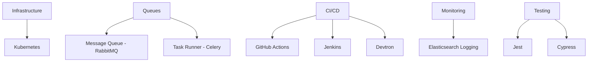

export const metadata = {
  title: 'Delhivery: Transforming Logistics Through Tech Innovation',
  description:
    'How I engineered systems that optimized last-mile delivery, reduced operational costs, and improved scalability for India’s largest logistics platform.',
  alternates: {
    canonical: '/experience/delhivery',
  },
}

<Cover
  src="https://cdn.cosmos.so/45b3c7a1-25a8-4e7f-9c3d-1f7a8d2e4f6b?format=jpeg"
  alt="Logistics network visualization"
  caption="cosmos.com"
/>

# Revolutionizing Logistics Tech at Delhivery

Working at Delhivery, one of India’s logistics giants, meant solving problems at scale—millions of packages, tight delivery windows, and high expectations. I contributed to systems that didn’t just support operations—they _moved_ the country.

---

## Mission-Critical Platforms

### Polymapper: Smart Geolocation for Last-Mile

- Designed a “nearest facility predictor” using **Django Rest Framework** and **Next.js**
- Integrated **Leaflet.js** to visualise serviceable zones with interactive maps
- The goal was to cut misrouted deliveries—and we did

### Flare: Automation in Action

- Engineered an intelligent dispatch system using **React** and **Flask**
- Introduced **RabbitMQ** and **Celery** to decouple processing from the UI
- The system could assign packages in real-time based on capacity and geography

---

## Reimagining Legacy & Infrastructure

### Reactifying the Stack

- Spearheaded the migration from **Angular** to **React**
- Introduced **Tanstack Query** to simplify and speed up data fetching
- The revamped frontend was cleaner, faster, and easier to maintain

### Scalable, Cost-Efficient Infrastructure

- Transitioned infrastructure from **AWS to GCP**, orchestrated via **Kubernetes**
- Tuned job queues using **Celery**, improving response times under peak loads
- Actively collaborated in setting up resilient CI/CD with **GitHub Actions**, **Jenkins**, and **Devtron**

---

## Collaboration and Culture

From mentoring junior developers to resolving critical production incidents, I wore many hats. Pair programming and team knowledge-sharing were part of my weekly rhythm, not a quarterly checkbox.

---

## Engineering Toolchain

