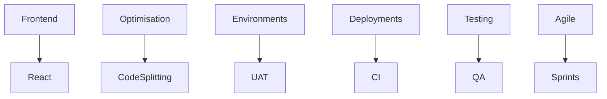

---

### `enum-informatics.mdx`

```mdx
export const metadata = {
  title: 'Enum Informatics: Laying My Frontend Foundations',
  description:
    'Where I honed my frontend engineering skills, built reusable systems, and embraced production-ready development in a fast-paced environment.',
  alternates: {
    canonical: '/experience/enum-informatics',
  },
}

<Cover
  src="https://cdn.cosmos.so/5089a452-88f6-4938-8456-43d173e9fa56?format=jpeg"
  alt="Abstract dashboard UI"
  caption="cosmos.com"
/>

# Engineering Frontends at Enum Informatics

Enum was my launchpad. It’s where I first saw code running in the wild, where my UI broke in production—and I learned to fix it fast.

---

## Systems that Scale

### Component Libraries That Work

- Built a reusable component library in **React**—the same buttons, inputs, and layouts powered multiple enterprise products
- This wasn’t about DRY code—it was about speed, consistency, and developer happiness

### Optimised Delivery

- Implemented **Code Splitting**, cutting down first-load times and giving users that instant app feel
- Configured UAT environments on client servers so QA could test _real_ builds, not just developer dreams

---

## Developer Workflow

- Set up Git-based pipelines and structured code reviews
- Worked with teams across time zones—deployments had to be smooth, no 2 AM hotfixes
- Practiced Agile without the buzzwords: just small iterations, tight feedback loops, and working software

---

## Habits That Lasted

Enum taught me the rhythms of production engineering. From estimations to releases, I learned to build for change and plan for breakage.


